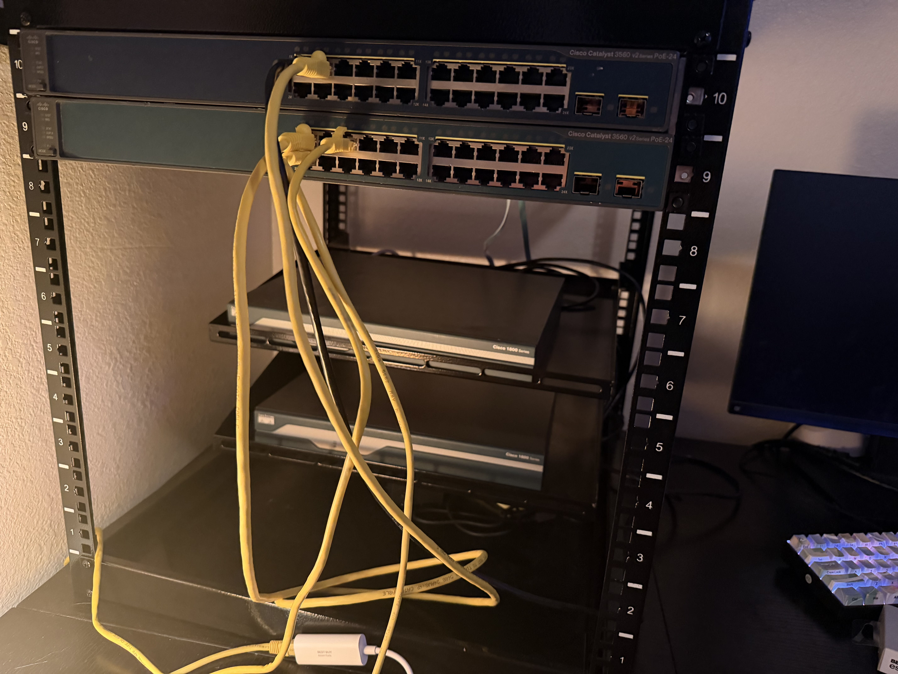

# OSPF and DHCP Lab

## Overview
- This lab displays a Layer 3 switch participating in a OSPF routing domain while providing
  inter-VLAN routing and DHCP services

## Objectives
- Configure VLANs to segment the network traffic
- Configure trunk links between the switches using 802.1Q encapsulation
- Implement inter-VLAN routing using SVIs with the multilayer switch
- Configure DHCP pools on the multilayer switch to dynamically assign IP address to devices
- Configure OSPF between the multilayer switch and routers
- Test DHCP functionality and network using virtual machines on Oracle Virtual Box

## Topology
    R2
    |
    |
    |
    R1
    |               _ _ VLAN 10
    |              |
    SW1 ===== SW2---_ _ VLAN 20

## IP Addressing and VLAN

| Name    | Subnet        | VLAN |
|---------|---------------|------|
| IT      | 192.168.0.0/24| 10   |
| Sales   | 192.168.1.0/24| 20   |

## Key Configurations

## VLANs
- Created VLANs on both switches to segment the traffic

- VLAN 10 - IT
- VLAN 20 - Sales

## Trunk Configuration
- Configured a 802.1Q trunk between SW1 and SW2 allowing
  VLANs 10 and 20

## Inter-VLAN Routing
- Configured SW1 as a Layer 3 switch using switch virtual interfaces
  to route traffic between VLANs

## OSPF Routing
- Configured OSPF area 0 between the routers and swtich to allow
  dynamic routing

## Verification
- Verified routing table entries
    - `show ip route`
- Verified trunk configuration
    - `show interfaces trunk`
- Verified interface status
    - `show ip interface brief`
- Verified OSPF neighbor status
    - `show ip ospf neighbor`

## VM Testing
- Using Oracle Virtual Box where a laptop acted as a IT device and a desktop acted as a Sales device
    - Laptop was assigned enp0s3 inet address of 192.168.0.1
    - Desktop was assigned enp0s3 inet address of 192.168.1.1
- Connectivity was confirmed by
    - Pinging the default gateways
    - Pinging device on other VLAN

## What I Learned

- How to implement DHCP services to dynamically assign IP addresses
- How to request DHCP for ip address in Oracle Virtual Box with command
    - `sudo dhcpcd enp0s3`
- How to identifcy and troubleshoot OSPF issues such as the routers not becoming neighbors

## Home Lab Setup

Below is a picture of my homelab set up for this lab

